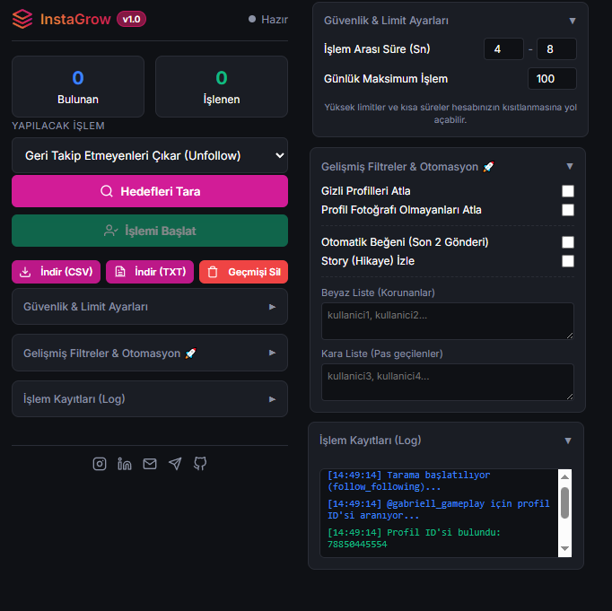

  
  
  # InstaGrow - All-in-One Instagram Otomasyon Aracı 🚀
  
  **Instagram'da organik etkileşim ve güvenli takipçi yönetimi için tasarlanmış en kapsamlı, yeni nesil ve anti-ban korumalı Chrome Eklentisi.**
  
  
  

---

## 🌟 Proje Hakkında (Neden InstaGrow?)

Instagram hesabı büyütmek ya da yönetmek eskiden çok zaman alıcı, riskli ve sıkıcı bir işti. **InstaGrow**, bu süreci tamamen otomatikleştirerek hesabınızı **uyurken bile** organik olarak büyütmenizi sağlar! 

Bizi diğer uygulamalardan ayıran en büyük farkımız: **Güvenlik ve Akıllı Hedefleme**. 

Eğer siz de; 
* Sizi takip etmeyenleri tek tek bulup çıkarmaktan yorulduysanız, 
* Rakiplerinizin takipçilerini ya da gönderilerini beğenen aktif kitleyi kendi tarafınıza çekmek istiyorsanız, 
* Güvenli sınırları aşmadan, Instagram kısıtlamalarına takılmadan (Anti-Ban) işlem yapmak istiyorsanız;
**InstaGrow tam size göre!** 🎯

## 🔥 Öne Çıkan Özellikler

### 🛡️ 1. Üst Düzey Güvenlik ve Anti-Ban (Rate-Limiting)
Instagram algoritmalarının radarına yakalanmamak için asistanımız "insan gibi" davranır.
* **Gecikmeli İşlem:** İşlemler arasına rastgele 5 ila 10 saniye (veya sizin belirlediğiniz bir süre) koyarak bot davranışından kaçınır.
* **Günlük Limitler:** Belirlediğiniz maksimum işlem (örn: 100 kişi) sınırına ulaştığında otomatik olarak durur.

### 🎯 2. Akıllı İşlem Çeşitliliği (Context-Aware)
Bulunduğunuz sayfaya göre en etkili işlemleri tek tuşla yapar:
* **Takip Etmeyenleri Çıkar (Unfollow):** Sadece sizi geri takip etmeyenleri bulur ve sessizce çıkarır.
* **Takipçileri & Takipleri Takip Et:** Hedeflediğiniz sayfanın takipçilerini (potansiyel kitlenizi) otomatik takip eder.
* **Beğenenleri & Yorum Yapanları Takip Et:** Bir gönderiyi (Post/Reels) aktif olarak beğenen ve yorumlayan, etkileşimi yüksek sıcak kitleyi toplar!

### 🤖 3. Gelişmiş Filtreler & Otomasyon (Premium Özellikler)
Hedef kitlenizi nokta atışı belirleyin ve etkileşiminizi uçurun!
* **Kara Liste (Blacklist) ve Beyaz Liste (Whitelist):** Patron sizsiniz! Çıkarmak istemediğiniz dostlarınızı korumaya alın, etkileşim kurmak istemediklerinizi kara listeye atın.
* **Gizli & Resimsiz Profilleri Atla:** Takipçisi veya gönderisi olmayan 'hayalet hesaplarla' vakit kaybetmeyin.
* **Otomatik Beğeni (Auto-Like):** Birini takip etmeden *hemen önce* son 2 gönderisini otomatik beğenir. Geri takip oranınızı x3 katına çıkarır!
* **Otomatik Hikaye (Story)İzleme:** Takip etmek üzere olduğunuz kişinin hikayesini sessizce 'görüldü' yapar. Merak uyandırır ve dikkat çeker!

### 📊 4. Detaylı Kayıt (Log) ve Dışa Aktarma
Ne yaptığınızı asla unutmayın:
* Gerçek zamanlı olarak arayüzde tüm logları saniye saniye izleyin.
* Geçmişi **TXT** formatında saniyeler içinde bilgisayarınıza kaydedin, raporlayın!

## ⚙️ Kurulum (Nasıl Kullanılır?)

1. Bu projeyi bilgisayarınıza indirin (`Clone` veya `Download ZIP`).
2. Google Chrome tarayıcınızı açın ve adres çubuğuna `chrome://extensions/` yazın.
3. Sağ üst köşeden **"Geliştirici Modu"** (Developer mode) seçeneğini aktif hale getirin.
4. Sol üstten **"Paketlenmemiş öğe yükle"** (Load unpacked) butonuna tıklayın.
5. İndirdiğiniz klasörün içindeki `extension` klasörünü seçin.
6. Sağ üstteki yapboz ikonundan **InstaGrow** eklentisini sabitleyin ve kullanmaya başlayın!

## 📞 İletişim & Geliştirici Bilgileri

Bu proje, Instagram organik büyüme süreçlerini optimize etmek için **Gökhan Taylan** tarafından büyük bir emekle geliştirilmiştir. 👇

  
  
  
  
  
  
  
    
  
  ⭐ *Projeyi beğendiyseniz sağ üstten yıldız vermeyi (Star) unutmayın!* 

