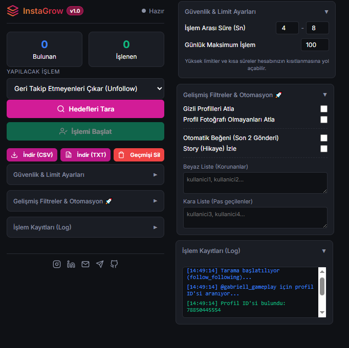

<div align="center">
  
  
  # InstaGrow - All-in-One Instagram Otomasyon Aracı 🚀
  
  **Instagram'da organik etkileşim ve güvenli takipçi yönetimi için tasarlanmış kapsamlı, anti-ban korumalı Chrome Eklentisi.**
  
  [](https://github.com/gkhantyln)
  [](https://google.com/chrome)
  [](https://developer.chrome.com/docs/extensions/mv3/)
</div>

---

## 🌟 Proje Hakkında

Instagram hesabı büyütmek ya da yönetmek eskiden çok zaman alıcı, riskli ve sıkıcı bir işti. **InstaGrow**, bu süreci tamamen otomatikleştirerek hesabınızı organik olarak büyütmenizi sağlar. Tüm işlemler Instagram'ın kendi API'leri üzerinden yapılır; üçüncü taraf sunucu kullanılmaz.

---

## 🔥 Özellikler

### 🎯 Takip İşlemleri (Profil Sayfasından)
- **Bu Kişinin Takipçilerini Takip Et** — Hedef profilin takipçilerini otomatik takip eder
- **Bu Kişinin Takip Ettiklerini Takip Et** — Hedef profilin takip listesini takip eder

### 📸 Gönderi / Reels İşlemleri
- **Gönderiyi Beğenenleri Takip Et** — Bir post veya reels'i beğenen aktif kitleyi takip eder (V1 API + GraphQL hibrit)
- **Gönderiye Yorum Yapanları Takip Et** — Yorum yapan etkileşimli kitleyi takip eder

### 🗑️ Takipten Çıkarma İşlemleri
- **Geri Takip Etmeyenleri Çıkar (Tüm Liste)** — Takip ettiğin ama seni takip etmeyenlerin tamamını bulur
- **Geri Takip Etmeyenleri Çıkar (Uygulama ile Takip Edilenler)** — Sadece InstaGrow ile takip ettiğin kişiler arasından geri takip etmeyenleri bulur; takip geçmişi `followedByApp` olarak saklanır
- **Geri Takip Edenleri Çıkar** — Seni takip eden ama senin takip ettiğin kişileri çıkarır
- **Hesabı Gizli Olanları Çıkar** — Takip ettiğin private hesapları toplu çıkarır

### 🤖 Gelişmiş Filtreler & Otomasyon
- **Beyaz Liste (Whitelist)** — Korunacak hesapları belirle, tüm işlemlerden muaf tut
- **Kara Liste (Blacklist)** — Etkileşim kurulmayacak hesapları listele
- **Gizli Profilleri Atla** — Tarama ve işlem sırasında private hesapları geç
- **Profil Fotoğrafı Olmayanları Atla** — Varsayılan avatarlı (fotoğrafsız) hesapları filtrele
- **Otomatik Beğeni (Auto-Like)** — Takip etmeden önce hedefin son 2 gönderisini otomatik beğen
- **Otomatik Hikaye İzleme (Auto-Story)** — Takip etmeden önce hikayeyi görüldü olarak işaretle

### 📊 Liste Sayfası (list.html)
- **Karşılaştır Görünümü** — Following ve Followers listelerini yan yana gösterir; eşleşenler yeşil ile işaretlenir
- **Liste Görünümü** — Tablo formatında detaylı kullanıcı listesi
- Kullanıcı adı, ID, hesap türü (gizli/açık), geri takip durumu ve takip tarihi sütunları
- Arama, filtreleme (gizli/açık, geri takip durumu, hariç tutulanlar)
- Sütun başlıklarına tıklayarak sıralama
- Tekil kullanıcıyı listeden kaldırma, hariç tutma veya not ekleme
- Toplu seç / seçimi kaldır / seçilenleri kaldır
- **İşlemi Başlat** — Seçili kullanıcılar için doğrudan Instagram sekmesine işlem komutu gönderir
- **CSV İndir** — İşlem geçmişini Excel uyumlu CSV olarak dışa aktar
- **TXT İndir** — İşlem geçmişini düz metin olarak dışa aktar
- **JSON İndir** — İşlem geçmişini JSON formatında dışa aktar
- **Geçmişi Sil** — Tüm işlem geçmişini temizle
- Profil fotoğrafları lazy-load ile yüklenir (concurrency: 5)

### 🛡️ Güvenlik & Anti-Ban
- İşlemler arasına rastgele gecikme (ayarlanabilir min/max saniye)
- Günlük maksimum işlem limiti (aşılınca otomatik durur)
- Her 5 işlemde bir uzun mola (ayarlanabilir)
- Rate limit (HTTP 429) algılama — Instagram kısıtlaması gelince işlem otomatik durur
- Tarama sırasında döngü başına bekleme süresi ayarlanabilir
- Her 5 tarama döngüsünden sonra uzun bekleme

### ⚙️ Gelişmiş Zamanlama Ayarları
| Ayar | Varsayılan | Açıklama |
|------|-----------|----------|
| İşlem Arası Süre | 5–10 sn | Takip/unfollow işlemleri arası rastgele bekleme |
| Günlük Limit | 100 | Günde yapılacak maksimum işlem sayısı |
| Arama Döngüsü Arası | 1500 ms | Her sayfa çekimi arasındaki bekleme |
| 5 Döngü Sonrası Bekleme | 5000 ms | Her 5 tarama döngüsünden sonra uzun mola |
| Takip Çıkarma Arası | 2000 ms | Unfollow işlemleri arası bekleme |
| 5 Çıkarma Sonrası Bekleme | 10000 ms | Her 5 unfollow'dan sonra uzun mola |
| Following Tarama Limiti | 0 (sınırsız) | Takip edilenlerden kaç kişi taransın |
| Followers Tarama Limiti | 0 (sınırsız) | Takipçilerden kaç kişi taransın |

### 🔑 Query Hash Sistemi
- Instagram GraphQL query hash'leri otomatik olarak Instagram ana sayfasından çekilir
- Hash'ler 24 saat boyunca cache'de saklanır, süresi dolunca otomatik yenilenir
- **Hash Güncelle** butonu ile manuel güncelleme yapılabilir
- Hash bulunamazsa bilinen fallback hash'ler devreye girer

### 📝 Takip Geçmişi (followedByApp)
- InstaGrow ile takip edilen her kullanıcı `followedByApp` listesine kaydedilir
- Kayıt: kullanıcı ID, kullanıcı adı, takip tarihi
- "Tracked Mod" ile sadece bu liste üzerinden geri takip etmeyenler bulunur
- Unfollow yapılınca kişi geçmişten otomatik silinir

### 📋 İşlem Logları
- Popup içinde gerçek zamanlı log paneli (accordion)
- Log panelinde anlık temizleme butonu
- Son 50 log popup'ta gösterilir
- İşlem geçmişi (CSV/TXT/JSON) maksimum 5000 kayıt saklar

---

## 🖥️ Kullanım Akışı

```
1. Popup'u aç
2. Yapılacak işlemi seç (dropdown)
3. Ayarları yapılandır (limit, gecikme, filtreler)
4. "Hedefleri Tara" butonuna bas
   → Tarama tamamlanınca Liste Sayfası otomatik açılır
5. Liste Sayfasında kullanıcıları incele, filtrele, seç
6. "İşlemi Başlat" butonuna bas
   → Seçili kullanıcılar için işlem başlar
7. İşlem geçmişini CSV / TXT / JSON olarak indir
```

---

## ⚙️ Kurulum

1. Projeyi bilgisayarınıza indirin (`Clone` veya `Download ZIP`).
2. Chrome'da `chrome://extensions/` adresine gidin.
3. **Geliştirici Modu**'nu aktif edin.
4. **Paketlenmemiş öğe yükle** butonuna tıklayın.
5. `extension` klasörünü seçin.
6. Eklentiyi sabitleyin ve kullanmaya başlayın.

---

## 📁 Dosya Yapısı

```
extension/
├── manifest.json       # Chrome Manifest V3 yapılandırması
├── background.js       # Service worker: state yönetimi, image proxy
├── content.js          # Instagram sayfasında çalışan ana script
├── popup.html/js/css   # Eklenti popup arayüzü
├── list.html/js        # Kullanıcı listesi ve işlem sayfası
├── guide.html          # Kullanım kılavuzu
└── icon*.png           # Eklenti ikonları
```

---

## ⚠️ Önemli Notlar

- Bu eklenti yalnızca kendi hesabınız üzerinde işlem yapar.
- Yüksek işlem hızları ve düşük gecikmeler hesabınızın kısıtlanmasına yol açabilir.
- Followers limitini Following limitinden en az 3–4 kat büyük ayarlayın (doğru eşleşme için).
- Eklenti hiçbir veriyi dış sunucuya göndermez; tüm veriler tarayıcı `localStorage`'ında saklanır.

---

## 📞 İletişim

<div align="center">
  
  <a href="https://github.com/gkhantyln" target="_blank">
    
  </a>
  <a href="https://www.linkedin.com/in/gkhantyln/" target="_blank">
    
  </a>
  <a href="https://www.instagram.com/ayzvisionstudio/" target="_blank">
    
  </a>
  <a href="https://t.me/llcoder" target="_blank">
    
  </a>
  <a href="mailto:tylngkhn@gmail.com">
    
  </a>
  
  <br/><br/>
  
  ⭐ *Projeyi beğendiyseniz yıldız vermeyi unutmayın!*
</div>
